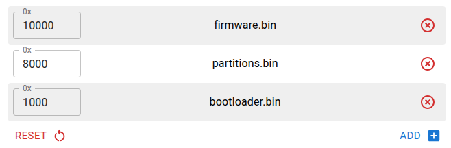

# WiFi Desktop Energy Monitor (CG2-SHELLY)

This is a free and open source project that displays live power usage from a Shelly device on a small TTGO T-Display.

The firmware polls the Shelly Cloud API and presents the current power on a tachometer-style gauge. It works as a stand-alone device: after setup, only a USB-C power supply and a Wi-Fi connection are required.

## Features

- Built-in Wi-Fi: no PC or phone required during normal operation
- Live power display in W or kW
- Large tachometer with progress arc and consumption marker
- Configurable 1-100 kW gauge scale (6 kW by default)
- Configurable refresh interval (5 seconds by default)
- Captive portal for Wi-Fi and Shelly Cloud setup
- Adjustable display brightness
- Manual refresh and deep sleep controls

## User Manual

### First setup

1. Power the TTGO T-Display through its USB-C port.
2. On first boot, or when no known Wi-Fi network is available, the device starts its own access point.
3. Connect a phone or computer to the `Shelly-Meter` Wi-Fi network using password `12345678`.
4. The captive portal should open automatically. If it does not, browse to [http://172.217.28.1](http://172.217.28.1).
5. Select **Configure new AP**, choose your Wi-Fi network, enter its password, and apply the configuration.
6. After connecting, the display shows the device IP address. If Shelly has not been configured yet, it also shows a QR code linking to the settings page.
7. Open **Settings** and configure:
   - `Device ID`: the Shelly device identifier, for example `a1b2c3d4e5f6`.
   - `Auth key`: the Shelly Cloud authorization key. Treat this value as a password.
   - `Refresh interval`: 1, 2, 3, 5, 10, 15, 30, 60, 120, 300, 600, 900, 1800, or 3600 seconds.
   - `Gauge maximum power`: tachometer full scale from 1 to 100 kW.
8. Select **Save**. The firmware verifies the Shelly credentials before storing them.

The settings page remains available at `http://<device-ip>/setup` while the device is connected to the same local network.

### Gauge scale

The configured maximum is the end of the colored arc. With the default 6 kW scale, the beginning represents 0 W and the end represents 6000 W. If consumption exceeds the configured maximum, the marker stays at the end of the arc while the numeric value continues to show the actual reading.

### Factory reset

- Hold Button 1 (GPIO35) while powering up to erase saved Wi-Fi networks and Shelly settings.
- Alternatively, open the device web interface, select **Reset**, and confirm.

After a factory reset, the device restarts in access-point mode and must be configured again.

### Buttons

- Button 1 short press: cycle display brightness.
- Button 1 long press (about 2 seconds): refresh the Shelly reading immediately.
- Button 2 short press: request an immediate refresh.
- Button 2 long press (about 2 seconds): enter deep sleep. Press Button 1 to wake the device.

## Shelly Compatibility

The firmware is designed and physically tested with the **Shelly Pro EM-50**. Based on the component schemas in the official Shelly documentation, the parser also supports these Gen2+ devices:

- **Shelly Pro EM / Pro EM-50**: sums `em1:0` and `em1:1`.
- **Shelly EM Gen3 and Gen4**: sums `em1:0` and `em1:1`.
- **Shelly EM Mini Gen4**: reads `em1:0`.
- **Shelly Pro 3EM, Pro 3EM-400, and Shelly 3EM Gen3**: reads `em:0` in triphase profile or sums `em1:0` through `em1:2` in monophase profile.
- **Shelly Plus PM Mini and Shelly PM Mini Gen3**: reads `pm1:0`.
- Single-channel Gen2+ relays and plugs exposing `switch:0.apower`, including **Shelly Plus 1PM**, **Plus 1PM Mini**, and **Shelly Pro 1PM**.

Compatibility outside the Pro EM-50 is based on documented API payloads and has not been verified on physical hardware.

Limitations:

- Gen1 devices use a different status format and are not supported.
- On multi-channel devices based on `switch:*`, only `switch:0` is read.
- Power exposed only through `cover:*`, `light:*`, or other component types is not supported.
- The Shelly Cloud endpoint is currently configured for `shelly-269-eu.shelly.cloud`.

## Requirements

- [LILYGO TTGO T-Display](https://www.lilygo.cc/products/lilygo%C2%AE-ttgo-t-display-1-14-inch-lcd-esp32-control-board)
- A compatible Shelly device with Shelly Cloud enabled
- Shelly device ID and Cloud authorization key
- 2.4 GHz Wi-Fi network with internet access
- USB-C power supply
- [3D-printable enclosure](stl/) (optional)
- 3.7 V LiPo battery with Micro JST 1.25 connector (optional)

## Download and Load the Firmware

Build the firmware as described below, then open the [ESP Web Tool](https://esp.huhn.me/) in a Chromium-based browser and flash these files:

| Address | File |
| --- | --- |
| `0x1000` | [`bin/bootloader.bin`](bin/bootloader.bin) |
| `0x8000` | [`bin/partitions.bin`](bin/partitions.bin) |
| `0x10000` | `.pio/build/ttgo-t1/firmware.bin` |

Use the layout shown here:



## Build From Source and Load the Firmware

1. Install [PlatformIO Core](https://platformio.org/install/cli).
2. Clone this repository:

   ```sh
   git clone https://github.com/giovantenne/CG2-SHELLY.git
   cd CG2-SHELLY
   ```

3. Build the firmware:

   ```sh
   pio run -e ttgo-t1
   ```

4. Connect the board through USB and upload it:

   ```sh
   pio run -e ttgo-t1 -t upload
   ```

Linux users may need to install the [PlatformIO udev rules](https://docs.platformio.org/en/latest/core/installation/udev-rules.html) before uploading.

### Run the test suite

The project includes on-device Unity tests for the Shelly response parser, configuration validation, EEPROM persistence, and runtime state.

Connect the board and run:

```sh
pio test -e ttgo-t1 -v
```

## Shelly Cloud Request

The firmware sends an HTTP POST request at the configured interval:

```sh
curl -X POST "https://shelly-269-eu.shelly.cloud/device/status" \
  -d "id=<device_id>&auth_key=<auth_key>"
```

The device ID and authorization key are URL-encoded before transmission. They are stored in the ESP32 EEPROM and are never included in the source code.

## Project Structure

- `src/app_state.cpp` and `include/app_state.h`: global state and web portal elements.
- `src/api.cpp` and `include/api.h`: Shelly Cloud client and status parser.
- `src/display.cpp` and `include/display.h`: tachometer and status screens.
- `src/config.cpp` and `include/config.h`: EEPROM loading, migration, and validation.
- `src/config_store.cpp` and `include/config_store.h`: configuration mutation and persistence.
- `src/app_store.cpp` and `include/app_store.h`: runtime state updates.
- `src/portal.cpp` and `include/portal.h`: captive portal, settings, and factory reset.
- `src/buttons.cpp` and `include/buttons.h`: brightness, refresh, and deep sleep controls.
- `src/hardware.cpp` and `include/hardware.h`: battery reading and hardware helpers.
- `include/board.h`: TTGO T-Display pin definitions.

## Disclaimer

- This project is not affiliated with or endorsed by Shelly Group.
- The displayed measurements are for informational purposes and must not be used as a certified billing or electrical safety instrument.
- Protect your Shelly Cloud authorization key as you would a password.
- There is no warranty for this software.
